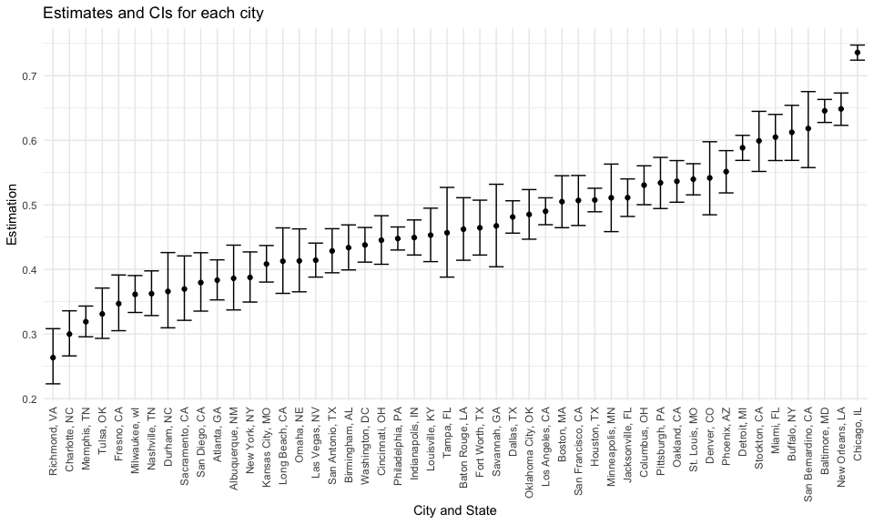
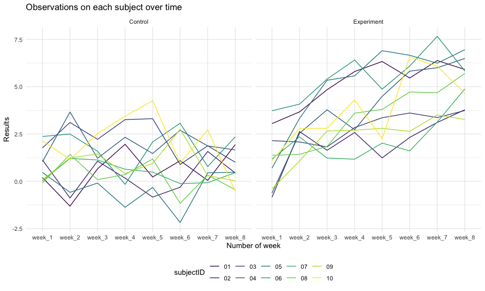

p8105\_hw5\_qw2331
================

## Problem 1

**Load the data**

``` r
homd_raw <- read_csv(
  "./data/homicide-data.csv",
  na = c("", "Unknown"))
```

**A brief description**

``` r
# Using summary or glimpse
summary(homd_raw)
```

    ##      uid            reported_date       victim_last        victim_first      
    ##  Length:52179       Min.   : 20070101   Length:52179       Length:52179      
    ##  Class :character   1st Qu.: 20100318   Class :character   Class :character  
    ##  Mode  :character   Median : 20121216   Mode  :character   Mode  :character  
    ##                     Mean   : 20130899                                        
    ##                     3rd Qu.: 20150911                                        
    ##                     Max.   :201511105                                        
    ##                                                                              
    ##  victim_race          victim_age     victim_sex            city          
    ##  Length:52179       Min.   :  0.0   Length:52179       Length:52179      
    ##  Class :character   1st Qu.: 22.0   Class :character   Class :character  
    ##  Mode  :character   Median : 28.0   Mode  :character   Mode  :character  
    ##                     Mean   : 31.8                                        
    ##                     3rd Qu.: 40.0                                        
    ##                     Max.   :102.0                                        
    ##                     NA's   :2999                                         
    ##     state                lat             lon          disposition       
    ##  Length:52179       Min.   :25.73   Min.   :-122.51   Length:52179      
    ##  Class :character   1st Qu.:33.77   1st Qu.: -96.00   Class :character  
    ##  Mode  :character   Median :38.52   Median : -87.71   Mode  :character  
    ##                     Mean   :37.03   Mean   : -91.47                     
    ##                     3rd Qu.:40.03   3rd Qu.: -81.76                     
    ##                     Max.   :45.05   Max.   : -71.01                     
    ##                     NA's   :60      NA's   :60

-   This dataset contains `52179` observations and `12` variables with
    `4` numeric variables and `8` character variables.
-   Of all variables, the key ones are:
    -   `uid` is unique id for each observation;
    -   Variables including
        `victim_last, victim_first, victim_race, victim_age, victim_sex`
        contain the basic demographic information about each victim;
    -   Variables like `city, state, lat, lon` represent the location of
        the killing;
    -   Variable `disposition` includes values like
        `Closed without arrest, Closed by arrest, Open/No arrest`. A
        homicide to be considered as `Closed with arrest` when police
        reported that to be the case, while `Closed without arrest`
        means there is sufficient evidence but an arrest is impossible.
        And all other cases were classified as `Open/No arrest`.

**Data mutation**

``` r
homd_df <- 
  homd_raw %>% 
  mutate(
    city_state = str_c(city, ", ", state),
    status = ifelse(disposition == "Closed by arrest", "solved", "unsolved")
  ) %>% 
  filter(city_state != "Tulsa, AL") %>% 
  relocate(city_state)

homd_df %>% 
  group_by(city_state) %>% 
  summarize(
    ttl_homicide = n(),
    unsol_homicide = sum(status == "unsolved")
  )
```

    ## # A tibble: 50 × 3
    ##    city_state      ttl_homicide unsol_homicide
    ##    <chr>                  <int>          <int>
    ##  1 Albuquerque, NM          378            146
    ##  2 Atlanta, GA              973            373
    ##  3 Baltimore, MD           2827           1825
    ##  4 Baton Rouge, LA          424            196
    ##  5 Birmingham, AL           800            347
    ##  6 Boston, MA               614            310
    ##  7 Buffalo, NY              521            319
    ##  8 Charlotte, NC            687            206
    ##  9 Chicago, IL             5535           4073
    ## 10 Cincinnati, OH           694            309
    ## # … with 40 more rows

**Proportion of homicides estimation for Baltimore, MD**

``` r
# Write a prop_test_function
prop_test_function <- function(city_df) {

  city_summary <- 
  city_df %>% 
  summarize(
    ttl = n(),
    unsol = sum(status == "unsolved")
  )

  city_test <- 
  prop.test(
  pull(city_summary, unsol),
  pull(city_summary, ttl)
)

  return(city_test)
  
}

# Create Baltimore dataframe
baltimore_df <- 
  homd_df %>% 
  filter(city_state == "Baltimore, MD")

prop_test_function(baltimore_df) %>% 
  broom::tidy() %>% 
  select(estimate, conf.low, conf.high)
```

    ## # A tibble: 1 × 3
    ##   estimate conf.low conf.high
    ##      <dbl>    <dbl>     <dbl>
    ## 1    0.646    0.628     0.663

**Run `prop.test` for each city**

``` r
result_df <- 
  homd_df %>% 
  nest(data = uid:status) %>% 
  mutate(
    test_results = map(data, prop_test_function),
    tidy_results = map(test_results, broom::tidy)
  ) %>% 
  unnest(tidy_results) %>% 
  select(city_state, estimate, starts_with("conf"))

result_df
```

    ## # A tibble: 50 × 4
    ##    city_state      estimate conf.low conf.high
    ##    <chr>              <dbl>    <dbl>     <dbl>
    ##  1 Albuquerque, NM    0.386    0.337     0.438
    ##  2 Atlanta, GA        0.383    0.353     0.415
    ##  3 Baltimore, MD      0.646    0.628     0.663
    ##  4 Baton Rouge, LA    0.462    0.414     0.511
    ##  5 Birmingham, AL     0.434    0.399     0.469
    ##  6 Boston, MA         0.505    0.465     0.545
    ##  7 Buffalo, NY        0.612    0.569     0.654
    ##  8 Charlotte, NC      0.300    0.266     0.336
    ##  9 Chicago, IL        0.736    0.724     0.747
    ## 10 Cincinnati, OH     0.445    0.408     0.483
    ## # … with 40 more rows

**Make a plot showing estimates and confidence intervals**

``` r
result_df %>% 
  mutate(
    city_state = fct_reorder(city_state, estimate)
  ) %>% 
  ggplot(aes(x = city_state, y = estimate)) + 
  geom_point() + 
  geom_errorbar(aes(ymin = conf.low, ymax = conf.high)) + 
  theme(
    axis.text.x = element_text(angle = 90, vjust = .5, hjust = 1)) + 
  labs(
    x = "City and State",
    y = "Estimation",
    title = "Estimates and CIs for each city"
  )
```



## Problem 2

**Create a dataframe containing data from all participants**

``` r
file_df <- 
  tibble(
    files = list.files("./data/zip_data/")
  )

longitudial_raw <- 
  file_df %>% 
  mutate(
    file_path = str_c("./data/zip_data/", files),
    data = map(file_path, read_csv)
  )

longitudial_df <- 
  longitudial_raw %>% 
  separate(files, into = c("arm", "subjectID", sep = "_")) %>%
  select(arm, subjectID, data) %>% 
  unnest(data) %>% 
  pivot_longer(
    3:10,
    names_to = "week_num",
    values_to = "data"
  )
```

**Make a spaghetti plot for each group**

``` r
longitudial_df %>% 
  mutate(
    arm = recode(
      arm,
      con = "Control",
      exp = "Experiment"
    )
  ) %>% 
  ggplot(aes(x = week_num, y = data, group = subjectID, color = subjectID)) + 
  geom_line() + 
  facet_grid(. ~ arm) + 
  labs(
    x = "Number of week",
    y = "Results",
    title = "Observations on each subject over time"
  )
```



From the above plots, while the results for the subjects in the
experiment group increase over time, the results in the control group
keep stable in general.

## Problem 3

**Introduce some missing values in each column**

``` r
set.seed(10)

iris_with_missing <- 
  iris %>% 
  map_df(~ replace(.x, sample(1:150, 20), NA)) %>% 
  mutate(Species = as.character(Species))

iris_with_missing
```

    ## # A tibble: 150 × 5
    ##    Sepal.Length Sepal.Width Petal.Length Petal.Width Species
    ##           <dbl>       <dbl>        <dbl>       <dbl> <chr>  
    ##  1          5.1         3.5          1.4         0.2 setosa 
    ##  2          4.9         3            1.4         0.2 setosa 
    ##  3          4.7         3.2          1.3         0.2 setosa 
    ##  4          4.6         3.1          1.5        NA   setosa 
    ##  5          5           3.6          1.4         0.2 setosa 
    ##  6          5.4         3.9          1.7         0.4 setosa 
    ##  7         NA           3.4          1.4         0.3 setosa 
    ##  8          5           3.4          1.5         0.2 setosa 
    ##  9          4.4         2.9          1.4         0.2 setosa 
    ## 10          4.9         3.1         NA           0.1 setosa 
    ## # … with 140 more rows

**Write a function**

``` r
fill_in_missing <- function(vector) {
  
  if (is.numeric(vector)) {
    vector <- replace(vector, is.na(vector), mean(vector, na.rm = TRUE))
  }
  
  else if (is.character(vector)) {
    vector <- replace(vector, is.na(vector), "virginica")
  }
  
  else {
    stop("Data should be either a number or a character")
  }
  
  return(vector)
  
}
```

**Apply the above function**

``` r
iris_with_missing %>% 
  map_df(~ fill_in_missing(.))
```

    ## # A tibble: 150 × 5
    ##    Sepal.Length Sepal.Width Petal.Length Petal.Width Species
    ##           <dbl>       <dbl>        <dbl>       <dbl> <chr>  
    ##  1         5.1          3.5         1.4         0.2  setosa 
    ##  2         4.9          3           1.4         0.2  setosa 
    ##  3         4.7          3.2         1.3         0.2  setosa 
    ##  4         4.6          3.1         1.5         1.19 setosa 
    ##  5         5            3.6         1.4         0.2  setosa 
    ##  6         5.4          3.9         1.7         0.4  setosa 
    ##  7         5.82         3.4         1.4         0.3  setosa 
    ##  8         5            3.4         1.5         0.2  setosa 
    ##  9         4.4          2.9         1.4         0.2  setosa 
    ## 10         4.9          3.1         3.77        0.1  setosa 
    ## # … with 140 more rows
